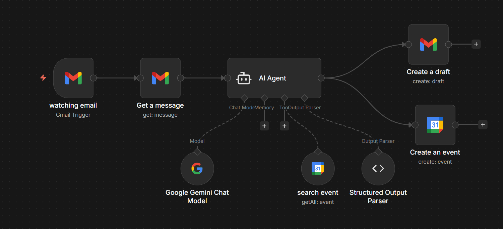

# AI Email Meeting Scheduler Agent (n8n + Gemini)

## Overview

AI Email Meeting Scheduler Agent is an AI-powered automation workflow built using **n8n**, **Google Gemini AI**, **Gmail**, and **Google Calendar**.

The system automatically reads incoming emails, understands whether the email contains a meeting request, checks the user's Google Calendar for availability, and schedules the meeting accordingly. It also generates a reply draft so the user can quickly confirm the meeting.

This project demonstrates how AI agents can automate real-world tasks such as **email processing, meeting scheduling, and calendar management**.

---

## Workflow Architecture

The following diagram shows the automation workflow built in **n8n**.

---

## Problem Statement

Professionals often receive multiple emails requesting meetings or appointments.
Manually checking calendars, scheduling meetings, and replying to emails can take time and effort.

This project automates the entire process using **AI and workflow automation**, helping users manage meeting requests efficiently.

---

## Solution

The system performs the following automated tasks:

• Monitors incoming Gmail messages
• Reads and analyzes email content
• Uses **Google Gemini AI** to understand the intent of the message
• Detects meeting or scheduling requests
• Checks Google Calendar for existing events
• Creates a new calendar event if required
• Generates a reply draft in Gmail

This automation significantly reduces manual work and improves productivity.

---

## Workflow Steps

1. **Gmail Trigger**
   Detects new incoming emails.

2. **Get Message**
   Retrieves the email content.

3. **AI Agent (Gemini)**
   Uses Gemini AI to understand the email and detect meeting requests.

4. **Google Calendar Check**
   Retrieves current events from Google Calendar.

5. **Create Event**
   If a meeting request is detected, a new calendar event is created.

6. **Create Draft Reply**
   Generates a reply draft confirming the scheduled meeting.

---

## Technologies Used

* n8n (Workflow Automation Platform)
* Google Gemini AI
* Gmail API
* Google Calendar API
* AI Agent Architecture
* Structured Output Parsing

---

## Example Use Case

Example email received:

"Hi, can we schedule a meeting tomorrow at 3 PM to discuss the project?"

AI Agent Actions:

1. Reads the email
2. Detects a meeting request
3. Checks calendar availability
4. Creates a Google Calendar event
5. Generates a reply draft confirming the meeting

---

## Repository Structure

AI-Email-Meeting-Scheduler-Agent-n8n
│
├── README.md
├── workflow.json
├── workflow.png

---

## Future Improvements

• Automatic meeting confirmation
• Multi-user calendar support
• Conflict detection and rescheduling
• Integration with Slack or WhatsApp
• AI-based email classification

---

## Author

**Saivignesh Pandian**
AI & Automation Enthusiast

GitHub: https://github.com/saivigneshpandian

